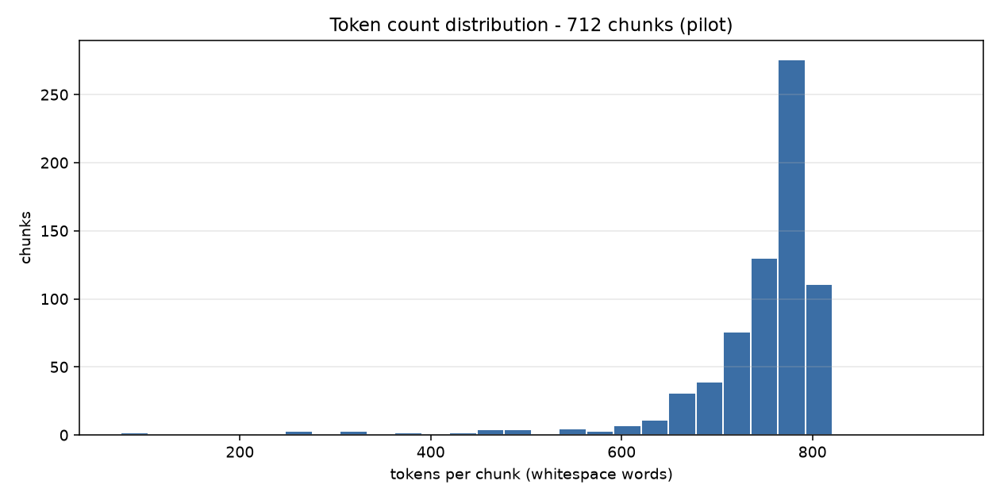

# EDA Report - Arabic Post-Training Data Factory (Pilot Batch)

- **Source corpus:** Hindawi via Arabic E-Book Corpus (HF) | **License:** CC-BY-4.0
- **Documents in:** 20 books
- **Chunks out:** 712
- **Total tokens:** 528,559 (*whitespace_word_count* approximation)
- **Pipeline:** `clean.py` -> `dedup.py` -> `chunk.py` -> `eda.py` (fully deterministic, no LLM calls)
- **Text variant chunked:** `original` - orthography preserved; normalization was used for matching/dedup only.

## 1. Token count distribution

`token_count` is a **word-based approximation**: whitespace-delimited words (`len(text.split())`). No subword tokenizer is applied at this stage, so the pipeline stays deterministic and model-agnostic. For MSA, a SentencePiece/BPE tokenizer typically yields ~1.5-2.5 subword tokens per word.

| statistic | tokens |
| --- | ---: |
| min | 75 |
| p25 | 730 |
| median (p50) | 768 |
| p75 | 787 |
| p90 | 795 |
| max | 936 |
| mean | 742.4 |

**708 / 712 chunks (99.4%) fall inside the 200-800 token target band.**

```
tokens/chunk        | histogram                                     count
    75-   147 |                                                   2
   147-   218 |                                                   1
   218-   290 |                                                   3
   290-   362 |                                                   3
   362-   434 |                                                   4
   434-   506 | #                                                 9
   506-   577 | #                                                 7
   577-   649 | ##                                               19
   649-   721 | ##########                                       99
   721-   792 | ##############################################  453
   792-   864 | ###########                                     111
   864-   936 |                                                   1
```



## 2. Domain distribution

| domain | docs | chunks | share | tokens | median tokens |
| --- | ---: | ---: | ---: | ---: | ---: |
| administrative | 5 | 240 | 33.7% | 177,454 | 764 |
| general_knowledge | 5 | 193 | 27.1% | 144,180 | 764 |
| science_tech | 5 | 176 | 24.7% | 130,370 | 770 |
| educational | 5 | 103 | 14.5% | 76,555 | 775 |
| **total** | 20 | **712** | 100.0% | **528,559** | 768 |

### Chunks per document

| doc_id | domain | paragraphs | chunks | tokens |
| --- | --- | ---: | ---: | ---: |
| 26931350 | administrative | 933 | 64 | 47,124 |
| 28158282 | administrative | 787 | 55 | 41,457 |
| 31951509 | administrative | 464 | 35 | 25,138 |
| 47908694 | administrative | 250 | 25 | 18,260 |
| 49613641 | administrative | 1,165 | 61 | 45,475 |
| 17271461 | educational | 739 | 19 | 14,147 |
| 17468173 | educational | 168 | 6 | 4,125 |
| 27060507 | educational | 148 | 4 | 2,810 |
| 72597415 | educational | 1,056 | 71 | 53,399 |
| 95147413 | educational | 125 | 3 | 2,074 |
| 14705258 | general_knowledge | 327 | 13 | 9,557 |
| 31484293 | general_knowledge | 2,244 | 118 | 89,230 |
| 35152952 | general_knowledge | 87 | 6 | 3,999 |
| 60373848 | general_knowledge | 527 | 17 | 12,562 |
| 69316182 | general_knowledge | 709 | 39 | 28,832 |
| 15393758 | science_tech | 312 | 20 | 15,155 |
| 28471509 | science_tech | 501 | 57 | 38,826 |
| 51493058 | science_tech | 827 | 33 | 25,684 |
| 81848130 | science_tech | 212 | 16 | 12,139 |
| 90820505 | science_tech | 1,327 | 50 | 38,566 |

### format_type distribution

| format_type | chunks | share |
| --- | ---: | ---: |
| narrative_paragraph | 689 | 96.8% |
| footnote_block | 11 | 1.5% |
| prose | 6 | 0.8% |
| list | 6 | 0.8% |

## 3. Cleaning stage and items flagged for review

- Characters in: **3,047,358** -> retained: **3,040,442** (**0.23%** removed overall)
- Flag threshold: a document is flagged when cleaning removes more than **30%** of its characters
- Diacritic stripping: **OFF** (default off - two children's books in this batch are fully vocalized)

Largest character deltas:

| doc_id | domain | chars in | chars retained | % removed | flags |
| --- | --- | ---: | ---: | ---: | --- |
| 90820505 | science_tech | 235,261 | 230,295 | 2.11% | - |
| 15393758 | science_tech | 88,393 | 87,949 | 0.50% | - |
| 31951509 | administrative | 145,860 | 145,573 | 0.20% | media_placeholders_removed |
| 69316182 | general_knowledge | 166,680 | 166,387 | 0.18% | - |
| 95147413 | educational | 18,283 | 18,256 | 0.15% | media_placeholders_removed |

### Documents flagged during cleaning: **5**

| doc_id | domain | title | % removed | flags |
| --- | --- | --- | ---: | --- |
| 31951509 | administrative | الشرق والغرب | 0.20% | media_placeholders_removed |
| 47908694 | administrative | المذكرات الجغرافية في الأقطار السورية | 0.01% | media_placeholders_removed |
| 27060507 | educational | شبـكة الـموت | 0.11% | media_placeholders_removed |
| 95147413 | educational | السَّعيدُ حَسَن | 0.15% | media_placeholders_removed |
| 28471509 | science_tech | مطالعات علمية | 0.14% | media_placeholders_removed |

**No document exceeded the 30% character-loss threshold.** Every flag above is `media_placeholders_removed`: empty `[]` / `[figure]` image placeholders carrying no text were pulled out of the body and recorded verbatim under `removed_placeholders` in the cleaned JSON, so nothing was lost.

### Chunks flagged

| flag | chunks | meaning |
| --- | ---: | --- |
| below_target_min | 3 | below 200 tokens - end-of-book tail, kept |
| oversize_paragraph | 1 | single paragraph > 800 tokens - kept whole, never split mid-paragraph |

| chunk_id | domain | tokens | paragraphs | flags |
| --- | --- | ---: | ---: | --- |
| 17271461_c0018 | educational | 99 | 5 | below_target_min |
| 28471509_c0052 | science_tech | 936 | 1 | oversize_paragraph |
| 31951509_c0034 | administrative | 75 | 2 | below_target_min |
| 35152952_c0005 | general_knowledge | 196 | 5 | below_target_min |

## 4. Deduplication

| metric | value |
| --- | ---: |
| documents scanned | 20 |
| exact duplicate groups (SHA-256) | 0 |
| documents removed as exact duplicates | 0 |
| MinHash/LSH candidate pairs | 0 |
| near-duplicate pairs confirmed | 0 |
| documents kept | 20 |

- Exact: `sha256 of whitespace-collapsed cleaned_text`
- Near: `MinHash+LSH, word 5-shingles, num_perm=128`, Jaccard threshold **0.8**, LSH candidates re-checked against the true Jaccard of the shingle sets to drop false positives
- Policy: `flag only, never auto-remove`

**Zero duplicates in the pilot** - expected for 20 distinct books from one source. Because a clean run proves nothing about the detector itself, `dedup.py --self-test` injects an exact copy and a ~0.85-Jaccard perturbed copy of a real document and asserts both are caught while an unrelated document is not. It passes.

## 5. Example chunks

3 chunks per domain, sampled deterministically (evenly spaced through each domain's chunk list), truncated to ~420 characters.

### administrative

**`26931350_c0000`** - 800 tokens - `narrative_paragraph` - paragraphs 0-21 (22 paras)  
*عمرو بن العاص* - عباس محمود العقاد

<div dir="rtl" lang="ar">

> الفصل الأول  
> نشأة عمرو بن العاص  
> نشأ عمرو بن العاص في بطن من البطون القرشية المشهورة، وهم بنو سهم.  
> والبطون القرشية كثيرة، تتفاوت في الضعف والقوة، والقلة والكثرة، ولكن البطون التي انتهى إليها الشرف — كما قال النسابة الكلبي — عشرة، اتصل شرفها في الجاهلية والإسلام، وهم: هاشم، وأمية، وعبد الدار، وأسد، ومخزوم، وعدي، وجمح، وسهم.  
> والظاهر من بعض أنباء «سهم» أنهم كانوا على كثرة في العدد، وإن لم يحسبوا من ذوي الصدارة في قريش …

</div>

**`31951509_c0000`** - 790 tokens - `narrative_paragraph` - paragraphs 0-17 (18 paras)  
*الشرق والغرب* - أحمد أمين

<div dir="rtl" lang="ar">

> مقدمة  
> في عام ١٩٤٧ دُعيت للاشتراك في مؤتمر المائدة المستديرة الذي عقد في لندن لبحث مشكلة فلسطين، وكان لزيارتي لأوروبا ذلك العام أثر كبير في تحديد مشاعري نحو الغرب، وأخذت أشك في صحة الاعتقاد السائد بتقدم الغرب على الشرق في مضمار الحضارة.  
> لمست نوعًا من الأخلاق والعادات والتقاليد يخالف ما لمسته في بلادنا، وشاهدت منظمات وصناعة وإنتاجًا لا عهد لبلادنا به، ومنذ ذلك الوقت بدأت تتزاحم في رأسي مئات من الأسئلة التي أردت أن أد …

</div>

**`49613641_c0060`** - 322 tokens - `list` - paragraphs 1134-1164 (31 paras)  
*شاعر أندلسي وجائزة عالمية* - عباس محمود العقاد

<div dir="rtl" lang="ar">

> وشبعت نفسي فرجعت إلى الشارع، تفتح الريح معطفي كما تفتح قلبي، فأبصر الوجوه الحسان، وأرى أشجار الحور في حديقة يوحنا الرباني آتية من مدريد. وأتحدث إلى كلب هنا وقطة هناك بالإسبانية، وأسمع صبيان الكنيسة يرتلون الصلوات باللسان العالمي الذي يتناجون به في جنات الفردوس وفي أفق القمر، وأحذو حذو النواقيس مع أشعة الظهيرة، حيث تعوم السماء في بحر تمازج فيه البنفسج والذهب على وفاق، كأنه قوس قزح على أبدع مثال.  
> إن الحب حلو كالضياء.
>  …

</div>

### educational

**`17271461_c0000`** - 796 tokens - `narrative_paragraph` - paragraphs 0-33 (34 paras)  
*آخر رجال الموهيكان* - جيمس فينيمور كوبر (tr. مروة عبد الفتاح شحاتة)

<div dir="rtl" lang="ar">

> الفصل الأول  
> ساحة المعركة  
> تجري وقائع هذه القصة في العام الثالث من الحرب الأخيرة بين فرنسا وإنجلترا. كانت الدولتان تتنازعان على الأرض التي ستصبح فيما بعد كندا والولايات المتحدة. شُيِّدت الحصون ودارت المعارك للاستحواذ عليها بعد أن فر الفلاحون من ساحات القتال. كانت حربًا ضارية، لا سيما إبان شهور الشتاء الباردة، وكانت الفرحة تغمر الجنود عندما يهل الصيف.  
> أيقظ صوت قرع طبول الحرب في منتصف الليل الجنود الإنجليز المتعبين وا …

</div>

**`72597415_c0022`** - 792 tokens - `narrative_paragraph` - paragraphs 334-340 (7 paras)  
*الرياح وأشجار الصفصاف* - كينيث جرام (tr. اسامة اسماعيل عبد العليم)

<div dir="rtl" lang="ar">

> ولكن حين مرا على نافذة صغيرة أُسدل ستارها لتصير محض قطعة صافية من الليل، فاض الكيل وتملكهما حنين شديد إلى البيت وحرمة العالم الصغير بين جدرانه؛ تلك الجدران التي تُنسيك وأنت في أحضانها ذلك العالم الخارجي الواسع بطبيعتِه المجهدة وتمنعه عنك. خلف ذلك الستار الأبيض، كان ظل قفص عصفور معلَّق واضحًا؛ كان كل ضلع فيه، والقصب التي يقف عليها العصفور وملحَقات القفص؛ جميعها كانت ظاهرة ويسهل تمييزها حتى من عجوز كليل البصر. بدا الطا …

</div>

**`95147413_c0002`** - 483 tokens - `narrative_paragraph` - paragraphs 99-124 (26 paras)  
*السَّعيدُ حَسَن* - كامل كيلاني

<div dir="rtl" lang="ar">

> بَعْدَ قَلِيلٍ، خَرَجَ الْحَطَّابُ وَزَوْجُهُ وَأَوْلادُهُما، بَعْدَ أَنِ اسْتَأْذَنُوا ضُيُوفَهُمْ.  
> اِنْطَلَقُوا يَتَحَدَّثُونَ — فِي أَثْناءِ تَجْوَالِهِمْ — عَمَّا رَأَوْهُ مِنَ الْعَجَبِ فِي لَيْلَتِهِمْ.  
> قالَ الْوالِدُ لِأَبْنائِهِ: «هَا أَنْتُمْ أُولاءِ تَرَوْنَ أَنَّ الْإنْسانَ يَسْتَطِيعُ — عَلَى قِلَّةِ مالِهِ — أَنْ يَعِيشَ سَعِيدًا. كَما تَرَوْنَ أَنَّهُ قادِرٌ — مَهْمَا يَبْلُغْ بِهِ الْفَقْرُ — عَلَى أ …

</div>

### general_knowledge

**`14705258_c0000`** - 738 tokens - `narrative_paragraph` - paragraphs 0-14 (15 paras)  
*السيد زخاريوس* - جول فيرن (tr. صفية مختار)

<div dir="rtl" lang="ar">

> (١) ليلة شتاء  
> تقع مدينة جنيف في الطرف الغربي للبُحَيرة التي تَحمل اسم المدينة. يمر نهر الرون عبر المدينة، عند منفذ البحيرة، ويَقسمها قسمَين، كما أن النهر نفسه يَنشطِر عند مركز المدينة إلى قسمَين بفعل جزيرة تقع في منتصف المجرى. مثل هذه السمة الطبوغرافية توجد غالبًا في المراكز التجارية والصناعية الكبرى، ولا شك أن السكان الأوائل تأثَّروا بوسائل النقل السهلة التي وفَّرتها لهم تيارات الأنهار السريعة؛ تلك «الطرق التي تَسي …

</div>

**`31484293_c0083`** - 757 tokens - `narrative_paragraph` - paragraphs 1441-1455 (15 paras)  
*نقض كتاب «في الشعر الجاهلي»* - محمد الخضر حسين

<div dir="rtl" lang="ar">

> مروي في شعر يعزى إلى النابغة، وقد أراد ابن هشام نفيه من شعر أمية وإلحاقه بالنابغة فقال: إلا آخرها بيتًا فإنه للنابغة في قصيدة له. وقضى به صاحب الأغاني^(٥) لأبي الصلت وقال: إنما أدخله النابغة في قصيدة له على جهة التضمين.  
> ولم يكن بعد هذين الشطرين وجه شبه بين أبيات أبي الصلت وأبيات ابن يسار سوى أن كلا الشعرين مصنوع في بحر الطويل، ومشتمل على شيء من مدح الفرس، ومراعى فيه مقاييس اللغة، وهذه أحوال عامة لا يبلغ التماثل فيها …

</div>

**`69316182_c0038`** - 505 tokens - `narrative_paragraph` - paragraphs 689-708 (20 paras)  
*فلسفة الوجود* - نقولا حداد

<div dir="rtl" lang="ar">

> وإذا كانت تلك الهياكل الروحانية مؤلفة من هذا الأيثر فلا بدَّ أن تشغل حيِّزًا أي مكانًا في الفضاء الأيثري، فهل تبقى فيه أجسامًا هيكلية سابحة في الفضاء، أو أنها تنحَلُّ فيه إلى فوتونات تمتزج مع فوتونات الأوقيانوس الفوتوني كما يمتزج ماء النهر بالبحر؟ وإن بقيت هياكل كما تكونت فما الذي يوطِّد قوامها ويحفظها من الانحلال إلى الأبد؟  
> وإذا تمادينا في تصوُّر هذه الهياكل الأيثرية الروحانية بدت لنا أسئلة عديدة عن وجودها وخلودها  …

</div>

### science_tech

**`15393758_c0000`** - 775 tokens - `narrative_paragraph` - paragraphs 0-19 (20 paras)  
*جيوبنا وجيوب الأجانب* - سلامة موسى

<div dir="rtl" lang="ar">

> صناعتنا وحضارتنا  
> منذ أكثر من ست سنوات وأنا أُبدي وأعيدُ في ضرورة نقل بلادنا من الحضارة الزراعية إلى الحضارة الصناعية، حتى لقد بات تكراري لهذا الموضوع وإدماني البحث فيه أشبه الأشياء بالهوس أو الوسواس.  
> ولكن مما يُثلِج قلبي أن أرى كثيرين غيري قد أصبحوا يروْن رأيي ويقولون به. فهم يرون الآن أن العالم قد شُطر شطرين؛ أحدهما: تلك الأمم الصناعية، وهي الأمم السَّائدة المُتمدنة، والآخر: هو الأمم الزراعية، وهي الأمم الشرقية ال …

</div>

**`51493058_c0010`** - 799 tokens - `narrative_paragraph` - paragraphs 294-337 (44 paras)  
*دراسات سيكلوجية* - سلامة موسى

<div dir="rtl" lang="ar">

> ولن يستطيع أحد أن يفكِّر بلا كلمات إلا إذا استعان على ذلك بعلامات الخرس … ولذلك يُسمى علم اللغة الجديد علم العلامات؛ أي السيمائية؛ لأن كلمة سيما تعني علامة.  
> لقد كبرت عقولنا باللغة … بالكلمات.  
> والفرق الأساسي بيننا وبين الشمبنزي، ليس أن مخَّنا أكبر من مخه، بل لأننا ننطق ولنا لغة، وهو أخرس ليست له لغة.  
> بل أعتقد أن مخنا أكبر من أمخاخ الشمبنزي وغيره من الحيوانات؛ لأن لنا لغة وليست لها لغة.  
> المخ البشري كبير نتيجة اللغة …

</div>

**`90820505_c0049`** - 765 tokens - `narrative_paragraph` - paragraphs 1319-1326 (8 paras)  
*تاريخ العقاقير والعلاج* - صابر جبرة

<div dir="rtl" lang="ar">

> وفي عام ١٨٨٢ لاحظ تاكاكي أن مرض بري بري المتفشي في الأسطول الياباني يمكن شفاؤه بإضافة الخضروات إلى اللحم وإلى أغذيته. وفي عام ١٨٩٠ كان إجكمان Eejkman يجري أبحاثه على مرض البري بري في جاوا، ولاحظ أن الطيور والدواجن إذا أطعمت على الأرز المصقول الأبيض الذي انتُزِع منه القشرة والجنين يحدث لها شلل في بعض أعضائها، يمكن شفاؤه إذا أطعمت بالأرز غير المقشور، ومن هنا أمكن أن يستنتج أن شفاء هذه الدواجن كان نتيجة لمادة تحويها قشو …

</div>

---

Generated by `src/data_engineering/eda.py`. Regenerate with:

```bash
python src/data_engineering/clean.py && python src/data_engineering/dedup.py && python src/data_engineering/chunk.py && python src/data_engineering/eda.py
```
