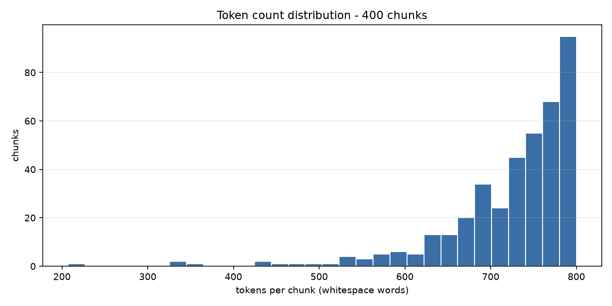

# EDA Report - أساس البلاغة

- **Source corpus:** Arabic Wikisource | **License:** CC BY-SA 4.0
- **Documents in:** 2
- **Source format:** `dictionary` (explicit per batch; clean.py and chunk.py must agree)
- **Chunks out:** 400
- **Total tokens:** 289,690 (*whitespace_word_count* approximation)
- **Pipeline:** `clean.py` -> `dedup.py` -> `chunk.py` -> `eda.py` (fully deterministic, no LLM calls)
- **Text variant chunked:** `original` - orthography preserved; normalization was used for matching/dedup only.

## 1. Token count distribution

`token_count` is a **word-based approximation**: whitespace-delimited words (`len(text.split())`). No subword tokenizer is applied at this stage, so the pipeline stays deterministic and model-agnostic. For Arabic, a SentencePiece/BPE tokenizer typically yields ~1.5-2.5 subword tokens per word.

| statistic | tokens |
| --- | ---: |
| min | 207 |
| p25 | 694 |
| median (p50) | 746 |
| p75 | 780 |
| p90 | 792 |
| max | 800 |
| mean | 724.2 |

**400 / 400 chunks (100.0%) fall inside the 200-800 token target band.**

```
tokens/chunk        | histogram                                     count
   207-   256 |                                                   1
   256-   306 |                                                   0
   306-   355 |                                                   2
   355-   405 |                                                   1
   405-   454 |                                                   2
   454-   504 | #                                                 3
   504-   553 | ##                                                7
   553-   602 | ###                                              12
   602-   652 | ######                                           26
   652-   701 | ###############                                  59
   701-   751 | #########################                       101
   751-   800 | ##############################################  186
```



## 2. Region distribution

| region | docs | chunks | share | tokens | median tokens |
| --- | ---: | ---: | ---: | ---: | ---: |
| classical | 1 | 394 | 98.5% | 285,500 | 746 |
| najdi | 1 | 6 | 1.5% | 4,190 | 796 |
| **total** | 2 | **400** | 100.0% | **289,690** | 746 |

### Chunks per document

| doc_id | region | unit type | units | chunks | tokens |
| --- | --- | --- | ---: | ---: | ---: |
| asas_albalagha | classical | entry_block | 3,372 | 394 | 285,500 |
| majam_alkalimat_alshaabia_najd | najdi | entry_block | 473 | 6 | 4,190 |

### format_type distribution

| format_type | chunks | share |
| --- | ---: | ---: |
| dictionary_entry | 400 | 100.0% |

## 3. Cleaning stage and items flagged for review

- Characters in: **1,622,994** -> retained: **1,615,308** (**0.47%** removed overall)
- Flag threshold: a document is flagged when cleaning removes more than **30%** of its characters
- Diacritic stripping: **OFF**

Largest character deltas:

| doc_id | region | chars in | chars retained | % removed | flags |
| --- | --- | ---: | ---: | ---: | --- |
| majam_alkalimat_alshaabia_najd | najdi | 23,551 | 22,607 | 4.01% | - |
| asas_albalagha | classical | 1,599,443 | 1,592,701 | 0.42% | - |

### Documents flagged during cleaning: **0**

None.

### Chunks flagged

None.

## 4. Deduplication

| metric | value |
| --- | ---: |
| documents scanned | 2 |
| exact duplicate groups (SHA-256) | 0 |
| documents removed as exact duplicates | 0 |
| MinHash/LSH candidate pairs | 0 |
| near-duplicate pairs confirmed | 0 |
| documents kept | 2 |

- Exact: `sha256 of whitespace-collapsed cleaned_text`
- Near: `MinHash+LSH, word 5-shingles, num_perm=128`, Jaccard threshold **0.8**, LSH candidates re-checked against the true Jaccard of the shingle sets to drop false positives
- Policy: `flag only, never auto-remove`

**Zero duplicates found** - expected for distinct documents from a single source. Because a clean run proves nothing about the detector itself, `dedup.py --self-test` injects an exact copy and a ~0.85-Jaccard perturbed copy of a real document and asserts both are caught while an unrelated document is not. It passes.

## 5. Example chunks

3 chunks per region, sampled deterministically (evenly spaced through each region's chunk list), truncated to ~420 characters.

### classical

**`asas_albalagha_c0000`** - 738 tokens - `dictionary_entry` - entry_block 0-13 (14 entry_blocks)  
*أساس البلاغة* - محمود بن عمر الزمخشري

<div dir="rtl" lang="ar">

> أبب: اطلب الأمر في إبانه وخذه بربانه * أي أوله وأنشد ابنُ الأعرابي اقد هرمتني قبل إبان الهرم وهي إذا قلت كلي قالت نعم اصحيحة المعدة من كل سقم لو أكلت فيلين لم تخش البشم وأبَّ للمسير إذا تهيّأ له وتجهز. قال الأعشى: اصرمت ولم أصرمكم وكصارم أخ قد طوى كشحاً وأب ليذهبا ونقول: فلان راع له الحب وطاع له الأب أي زكا زرعه واتسع مرعاه.  
> أبد: لا أفعله أبد الآباد وأبد الأبيد وأبد الآبدين. ونقول: رزقك الله عمراً طويل الآباد بعيد ا …

</div>

**`asas_albalagha_c0196`** - 540 tokens - `dictionary_entry` - entry_block 1649-1653 (5 entry_blocks)  
*أساس البلاغة* - محمود بن عمر الزمخشري

<div dir="rtl" lang="ar">

> صفح: نظر إليه بصفح وجهه وبصفح وجهه. وضربته على صفحه وعلى صفحته: على جنبه. وجلا صفحتي السيف. وكتب في صفحتي الورقة. وتصفح الشيء: تأمله ونظر في صفحاته. وتصفح القوم: نظر في أحوالهم أو نظر في خلالهم هل يرى فلاناً. وتصفح الأمر. وصفحت عنه: أعرضت عن ذنبه. وأتيت فلاناً في حاجة فصفحني عنها: ردني. وضربه بالسيف مصفحاً ومصفحاً: بعرضه لا بحده. ورأس مصفح: عريض. وصافحه بيده. وصفح بيديه وصفق. " والتسبيح للرجال والتصفيح للنساء ". واست …

</div>

**`asas_albalagha_c0393`** - 459 tokens - `dictionary_entry` - entry_block 3363-3371 (9 entry_blocks)  
*أساس البلاغة* - محمود بن عمر الزمخشري

<div dir="rtl" lang="ar">

> يفخ: وطئ فلان يوافيخ القروم إذا سلّمت له السّيادة والعلوّ. ومسّ بيافوخه السماك. وصدعوا يافوخ الليل إذا أدلجوا. قال ذو الرمّة: تيمّمن يافوخ الدجى فصدعنه وجوز الفلا صدع السيوف الصوادع علوت اليفاع. قال النابغة: وحلّت بيوتي في يفاعٍ ممنّعٍ تخال به راعي الحمولة طائرا ويفعت الجبل: صعدته. وأيفع الغلام وتيفّع وغلام يافع ويفعة وغلمان يفعة وأيفاع. وهم أيفاع صدق. قال: كهول ومرد من بني عمّ مالك وأيفاع صدق لو تملّيتهم رضا وترفّع  …

</div>

### najdi

**`majam_alkalimat_alshaabia_najd_c0000`** - 796 tokens - `dictionary_entry` - entry_block 0-78 (79 entry_blocks)  
*معجم الكلمات الشعبية في نجد* - عبدالرحمن بن عبدالعزيز المانع

<div dir="rtl" lang="ar">

> الغرب: هو الأداة المستعملة لرفع الماء من البثر عند الفلاحين ويتألف من :  
> الفاريه: وسط الغرب من الجهة الخلفية  
> الكم: .فم الغرب  
> المورده: .هي من الليف من جهه الغرب وتتصل بالعرقات  
> الأنباع: توضع فوق الدوامغ لتركب فوقها محاور المحال  
> الزرانيق: بناء على جانبى البثر من جهتين العمدان  
> الزابن: خشبه تتصل بالكافه والعمود لتمنع السريح من الخروج عن الدراجه  
> الجابيه: هي مجمع الماء بعد اخراجة من البر ومروره باللزا .  
> المصفاة: مكان …

</div>

**`majam_alkalimat_alshaabia_najd_c0002`** - 792 tokens - `dictionary_entry` - entry_block 156-229 (74 entry_blocks)  
*معجم الكلمات الشعبية في نجد* - عبدالرحمن بن عبدالعزيز المانع

<div dir="rtl" lang="ar">

> مَزُويه: عباءه سوداء من النوع الرديئ الصوف  
> برقع: غطاء للوجه تستعمله المرأة وبه  
> طريدة: القطعة الصغيرة من القماش ١78-  
> عمّه: . ما يعتم به على الرأس  
> مهاد: قطعة من القماش يلف بها الطفل لبحفظة ونحمى فراشه من الأوساخ التى تخرج منه  
> الهدمه: هي قطعة من القماش التي يلف فيها الصبي الصغير وتشبه الحفاظة  
> بغيله: من الخشب وبوسطها حبل يلف على قدمي من يراد فرشه وضرب قدمية  
> فُلَكه: مرادفه للكلمة السابقة بغيله  
> صميل: يشبه السقاء ول …

</div>

**`majam_alkalimat_alshaabia_najd_c0005`** - 207 tokens - `dictionary_entry` - entry_block 437-472 (36 entry_blocks)  
*معجم الكلمات الشعبية في نجد* - عبدالرحمن بن عبدالعزيز المانع

<div dir="rtl" lang="ar">

> صارف: العنز إذا طلبت التيس  
> معطي: الحماره إذا طلبت الحمار  
> تعه: تقال للبقرة لندائها  
> همس: للكلب لطرده  
> وهي: تقال للأبل لندائها -6م  
> إرارتح: تنادى به الضأن  
> إريض: تقال للكلب ليجلس دمي  
> صؤته: مخلفات الحمير  
> جله: هي الدمن وتستعمل وقوداً  
> يصهل: الحصان -4م7  
> حفّاه: شقوق فى خف الجما -741  
> جرب: مرض يصيب الإبل ويعم الجسم ولا يذهب إلا بالطلاء بالنورة والزرنيخ  
> تزراومَزر: يصيب ثدي الماعز والضأن  
> مصعد: إذا طرحت حملها قبل أن يكت …

</div>

---

Generated by `src/data_engineering/eda.py`. Regenerate with:

```bash
python src/data_engineering/clean.py && python src/data_engineering/dedup.py && python src/data_engineering/chunk.py && python src/data_engineering/eda.py
```
