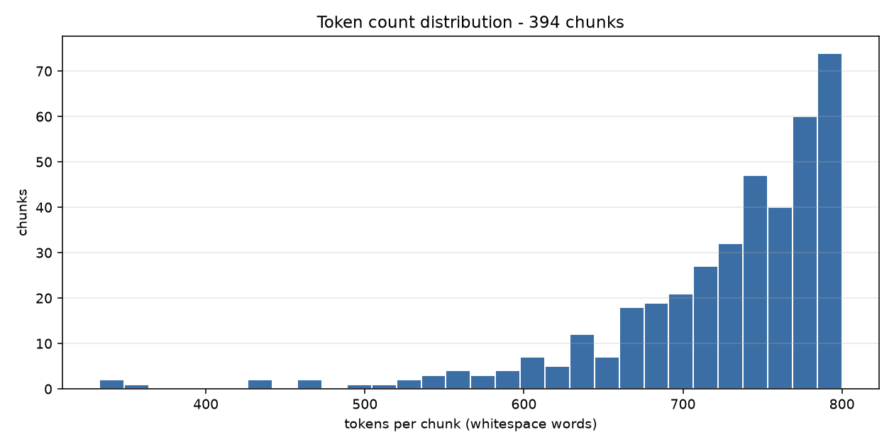

# EDA Report - Saudi Regional Dialect Corpus

- **Source corpus:** Arabic Wikisource | **License:** unverified_pending_review
- **Documents in:** 1
- **Source format:** `dictionary` (explicit per batch; clean.py and chunk.py must agree)
- **Chunks out:** 394
- **Total tokens:** 285,500 (*whitespace_word_count* approximation)
- **Pipeline:** `clean.py` -> `dedup.py` -> `chunk.py` -> `eda.py` (fully deterministic, no LLM calls)
- **Text variant chunked:** `original` - orthography preserved; normalization was used for matching/dedup only.

## 1. Token count distribution

`token_count` is a **word-based approximation**: whitespace-delimited words (`len(text.split())`). No subword tokenizer is applied at this stage, so the pipeline stays deterministic and model-agnostic. For Arabic, a SentencePiece/BPE tokenizer typically yields ~1.5-2.5 subword tokens per word.

| statistic | tokens |
| --- | ---: |
| min | 333 |
| p25 | 693 |
| median (p50) | 746 |
| p75 | 778 |
| p90 | 791 |
| max | 800 |
| mean | 724.6 |

**394 / 394 chunks (100.0%) fall inside the 200-800 token target band.**

```
tokens/chunk        | histogram                                     count
   333-   372 | #                                                 3
   372-   411 |                                                   0
   411-   450 | #                                                 2
   450-   489 | #                                                 2
   489-   528 | #                                                 2
   528-   566 | ###                                               9
   566-   605 | ###                                              10
   605-   644 | ######                                           21
   644-   683 | ##########                                       32
   683-   722 | ##################                               60
   722-   761 | ##############################                   99
   761-   800 | ##############################################  154
```



## 2. Region distribution

| region | docs | chunks | share | tokens | median tokens |
| --- | ---: | ---: | ---: | ---: | ---: |
| classical | 1 | 394 | 100.0% | 285,500 | 746 |
| **total** | 1 | **394** | 100.0% | **285,500** | 746 |

### Chunks per document

| doc_id | region | unit type | units | chunks | tokens |
| --- | --- | --- | ---: | ---: | ---: |
| asas_albalagha | classical | entry_block | 3,372 | 394 | 285,500 |

### format_type distribution

| format_type | chunks | share |
| --- | ---: | ---: |
| dictionary_entry | 394 | 100.0% |

## 3. Cleaning stage and items flagged for review

- Characters in: **1,599,443** -> retained: **1,592,701** (**0.42%** removed overall)
- Flag threshold: a document is flagged when cleaning removes more than **30%** of its characters
- Diacritic stripping: **OFF** (default off - two children's books in this batch are fully vocalized)

Largest character deltas:

| doc_id | region | chars in | chars retained | % removed | flags |
| --- | --- | ---: | ---: | ---: | --- |
| asas_albalagha | classical | 1,599,443 | 1,592,701 | 0.42% | - |

### Documents flagged during cleaning: **0**

None.

### Chunks flagged

None.

## 4. Deduplication

| metric | value |
| --- | ---: |
| documents scanned | 1 |
| exact duplicate groups (SHA-256) | 0 |
| documents removed as exact duplicates | 0 |
| MinHash/LSH candidate pairs | 0 |
| near-duplicate pairs confirmed | 0 |
| documents kept | 1 |

- Exact: `sha256 of whitespace-collapsed cleaned_text`
- Near: `MinHash+LSH, word 5-shingles, num_perm=128`, Jaccard threshold **0.8**, LSH candidates re-checked against the true Jaccard of the shingle sets to drop false positives
- Policy: `flag only, never auto-remove`

**Zero duplicates found** - expected for distinct documents from a single source. Because a clean run proves nothing about the detector itself, `dedup.py --self-test` injects an exact copy and a ~0.85-Jaccard perturbed copy of a real document and asserts both are caught while an unrelated document is not. It passes.

## 5. Example chunks

_Omitted from this build (`eda.py --no-examples`). This section is the only part of the report that reproduces source text verbatim, and this corpus carries `license: unverified_pending_review`. Regenerate without the flag for a local copy with excerpts._

---

Generated by `src/data_engineering/eda.py`.
