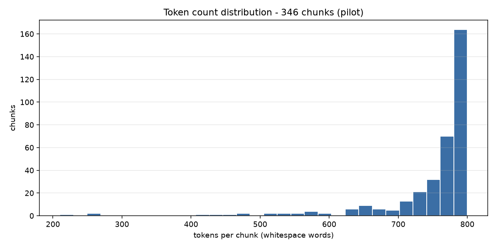

# EDA Report - Saudi Regional Dialect Corpus

- **Source corpus:** provided directly by the team, not from a public repo | **License:** unverified_pending_review
- **Documents in:** 5
- **Source format:** `dictionary` (explicit per batch; clean.py and chunk.py must agree)
- **Chunks out:** 346
- **Total tokens:** 259,497 (*whitespace_word_count* approximation)
- **Pipeline:** `clean.py` -> `dedup.py` -> `chunk.py` -> `eda.py` (fully deterministic, no LLM calls)
- **Text variant chunked:** `original` - orthography preserved; normalization was used for matching/dedup only.

## 1. Token count distribution

`token_count` is a **word-based approximation**: whitespace-delimited words (`len(text.split())`). No subword tokenizer is applied at this stage, so the pipeline stays deterministic and model-agnostic. For Arabic, a SentencePiece/BPE tokenizer typically yields ~1.5-2.5 subword tokens per word.

| statistic | tokens |
| --- | ---: |
| min | 210 |
| p25 | 746 |
| median (p50) | 778 |
| p75 | 793 |
| p90 | 798 |
| max | 800 |
| mean | 750.0 |

**346 / 346 chunks (100.0%) fall inside the 200-800 token target band.**

```
tokens/chunk        | histogram                                     count
   210-   259 |                                                   2
   259-   308 |                                                   1
   308-   358 |                                                   0
   358-   407 |                                                   0
   407-   456 | #                                                 3
   456-   505 |                                                   2
   505-   554 | #                                                 5
   554-   603 | #                                                 7
   603-   652 | ##                                                9
   652-   702 | ###                                              17
   702-   751 | #######                                          42
   751-   800 | ##############################################  258
```



## 2. Region distribution

| region | docs | chunks | share | tokens | median tokens |
| --- | ---: | ---: | ---: | ---: | ---: |
| najdi | 1 | 135 | 39.0% | 100,133 | 768 |
| southern | 1 | 105 | 30.3% | 79,767 | 781 |
| northern | 1 | 51 | 14.7% | 38,615 | 781 |
| eastern | 1 | 30 | 8.7% | 22,556 | 782 |
| western | 1 | 25 | 7.2% | 18,426 | 792 |
| **total** | 5 | **346** | 100.0% | **259,497** | 778 |

### ⚠ Under-resourced regions - priority for additional sourcing

| region | tokens | vs. median region | vs. largest region |
| --- | ---: | ---: | ---: |
| western | 18,426 | 48% | 18% |

**western** falls below 50% of the median regional token count. Additional sourcing here would do more for regional balance than more volume anywhere else in the corpus.

### Chunks per document

| doc_id | region | unit type | units | chunks | tokens |
| --- | --- | --- | ---: | ---: | ---: |
| dialect_dict_eastern | eastern | entry_headword | 872 | 30 | 22,556 |
| dialect_dict_najdi | najdi | entry_headword | 2,159 | 135 | 100,133 |
| dialect_dict_northern | northern | entry_headword | 1,192 | 51 | 38,615 |
| dialect_dict_southern | southern | entry_headword | 2,830 | 105 | 79,767 |
| dialect_dict_western | western | entry_headword | 791 | 25 | 18,426 |

### format_type distribution

| format_type | chunks | share |
| --- | ---: | ---: |
| dictionary_entry | 346 | 100.0% |

## 3. Cleaning stage and items flagged for review

- Characters in: **1,589,826** -> retained: **1,537,432** (**3.30%** removed overall)
- Flag threshold: a document is flagged when cleaning removes more than **30%** of its characters
- Diacritic stripping: **OFF** (default off - two children's books in this batch are fully vocalized)

Largest character deltas:

| doc_id | region | chars in | chars retained | % removed | flags |
| --- | --- | ---: | ---: | ---: | --- |
| dialect_dict_northern | northern | 238,188 | 227,638 | 4.43% | - |
| dialect_dict_najdi | najdi | 614,548 | 593,174 | 3.48% | - |
| dialect_dict_southern | southern | 484,268 | 470,105 | 2.92% | - |
| dialect_dict_eastern | eastern | 138,741 | 135,057 | 2.66% | - |
| dialect_dict_western | western | 114,081 | 111,458 | 2.30% | - |

### Documents flagged during cleaning: **0**

None.

### Chunks flagged

None.

## 4. Deduplication

| metric | value |
| --- | ---: |
| documents scanned | 5 |
| exact duplicate groups (SHA-256) | 0 |
| documents removed as exact duplicates | 0 |
| MinHash/LSH candidate pairs | 0 |
| near-duplicate pairs confirmed | 0 |
| documents kept | 5 |

- Exact: `sha256 of whitespace-collapsed cleaned_text`
- Near: `MinHash+LSH, word 5-shingles, num_perm=128`, Jaccard threshold **0.8**, LSH candidates re-checked against the true Jaccard of the shingle sets to drop false positives
- Policy: `flag only, never auto-remove`

**Zero duplicates in the pilot** - expected for 20 distinct books from one source. Because a clean run proves nothing about the detector itself, `dedup.py --self-test` injects an exact copy and a ~0.85-Jaccard perturbed copy of a real document and asserts both are caught while an unrelated document is not. It passes.

## 5. Example chunks

_Omitted from this build (`eda.py --no-examples`). This section is the only part of the report that reproduces source text verbatim, and this corpus carries `license: unverified_pending_review`. Regenerate without the flag for a local copy with excerpts._

---

Generated by `src/data_engineering/eda.py`.
